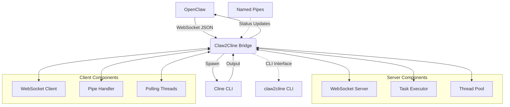
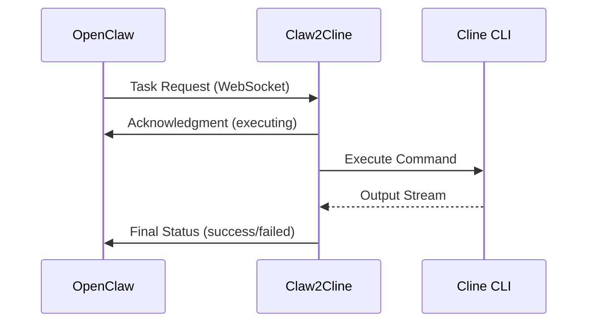

# System Patterns 
## System Architecture 

## Key Technical Decisions 
### 1. Threading-Based Notification Pattern 

- **Problem**: Long-running tasks block the calling agent 
- **Solution**: Immediate acknowledgment with threaded execution and callback notification 
- **Implementation**: WebSocket for real-time updates, subprocess for task isolation, threading for concurrency

### 2. Dual-Mode Architecture 

- **Server Mode**: Manages Cline instances, handles task execution 
- **Client Mode**: Forwards messages from OpenClaw, handles connection management 

### 3. Message Flow Pattern 

### 3.1 Bridge Pattern
- **Role**: Claw2Cline acts as the core bridge component
- **Purpose**: Decouple OpenClaw (abstraction) from Cline CLI (implementation)
- **Function**: Translates WebSocket messages ↔ CLI commands bidirectionally

### 3.2 Observer Pattern
- **Trigger**: Task completion/failure events
- **Action**: Automatically notify OpenClaw of task status
- **Benefit**: Decouples task execution logic from notification logic

### 3.3 Command Pattern
- **Implementation**: Tasks are encapsulated as standardized command objects
- **Key Benefits**:
    - Enables task queuing and prioritization
    - Simplifies logging and audit trails
    - Supports retry mechanisms for failed tasks

### 3.4 Thread Pool Pattern
- **Implementation**: Use ThreadPoolExecutor for managing concurrent task execution
- **Benefits**: 
    - Limits resource consumption
    - Provides graceful task management
    - Enables efficient concurrent processing

### 3.5 Named Pipe Integration
- **Purpose**: Seamless integration with existing OpenClaw pipe-based communication
- **Implementation**: Client daemon reads from request pipe, writes to response pipe
- **Benefits**: Maintains compatibility with existing workflows

### 3.6 Workspace and Project Management Pattern
- **Purpose**: Enable management of multiple projects in a workspace directory
- **Implementation**: 
  - CLI commands to list and manage projects in workspace (`/opt/tong/ws/git-repo`)
  - Project detection by common indicators (.git, README.md, package.json, etc.)
  - Directory switching functionality when executing project-specific commands
- **Benefits**:
  - Supports multi-project development environments
  - Provides context-aware command execution
  - Maintains project isolation while enabling centralized management
  - Enables project-specific Cline command execution

### 3.7 Project-Specific Execution Pattern
- **Purpose**: Execute commands within the context of a specific project directory
- **Implementation**:
  - `--project` or `-p` flag in CLI to specify target project
  - Automatic directory switching before command execution
  - Path validation to prevent security issues
  - Integration with Cline command construction (`cline -y -c "/path/to/project" "command"`)
- **Benefits**:
  - Enables project-aware development workflows
  - Maintains proper execution context for commands
  - Supports cross-project command execution
  - Provides secure directory switching with validation

## 4. Component Definition & Relationships

| Component             | Core Responsibility                                  | Implementation |
|-----------------------|------------------------------------------------------|----------------|
| WebSocket Server      | Receive tasks from OpenClaw, send execution acknowledgments | websocket-server |
| WebSocket Client      | Forward status/result messages back to OpenClaw       | websocket-client |
| Task Executor         | Spawn, monitor, and terminate Cline CLI subprocesses  | subprocess.Popen |
| Thread Pool Manager   | Handle concurrent task execution                      | ThreadPoolExecutor |
| Pipe Handler          | Manage named pipe I/O for CLI integration             | os.mkfifo, file I/O |
| Polling Manager       | Monitor task status via background threads            | threading |
| Config Manager        | Manage environment configs and runtime parameters     | config.py |

## 5. Critical Implementation Priorities
### Core Technical Paths (High Priority)
1. WebSocket Connection Reliability
   - Automatic reconnection logic
   - Heartbeat/keep-alive mechanism
   - Connection state monitoring
2. Subprocess Lifecycle Management
   - Safe process spawning
   - Real-time process monitoring
   - Graceful/forced termination
3. Threading Safety & Resource Management
   - Thread-safe data structures
   - Proper resource cleanup
   - Deadlock prevention
4. Error Handling & Recovery
   - Comprehensive error catching
   - Automatic recovery workflows
   - Fallback mechanisms for critical failures
5. Message Serialization/Deserialization
   - Standardized JSON schema for messages
   - Validation and error handling for malformed messages
6. Observability (Logging & Debugging)
   - Structured logging for all components
   - Debug mode support
   - Performance metrics collection
